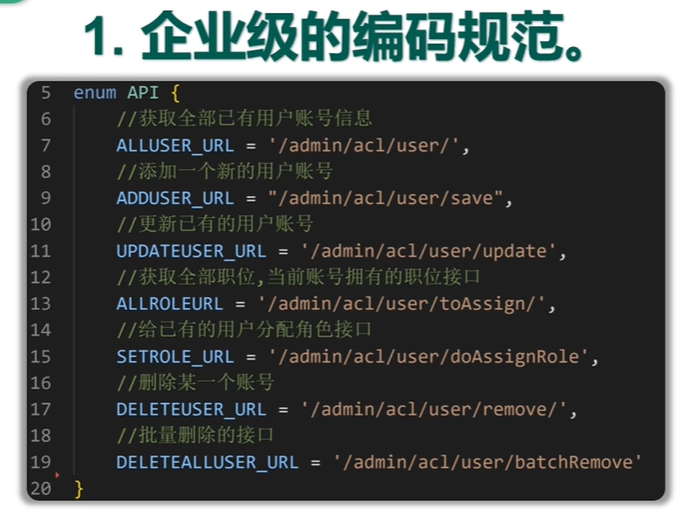
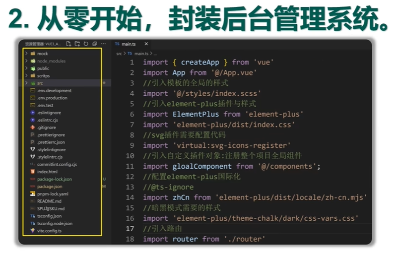
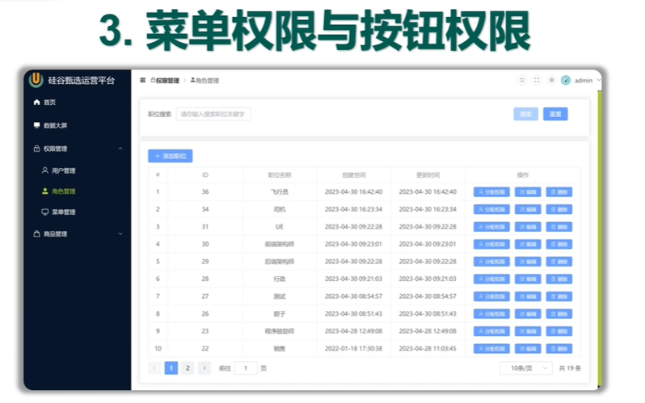
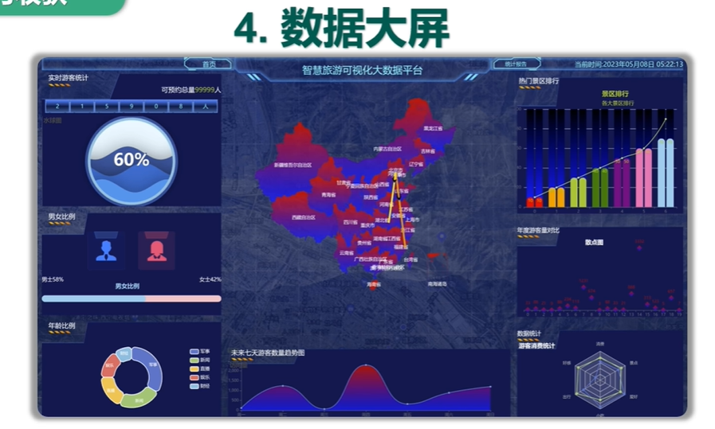
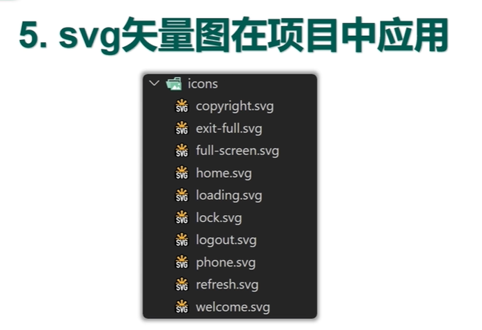
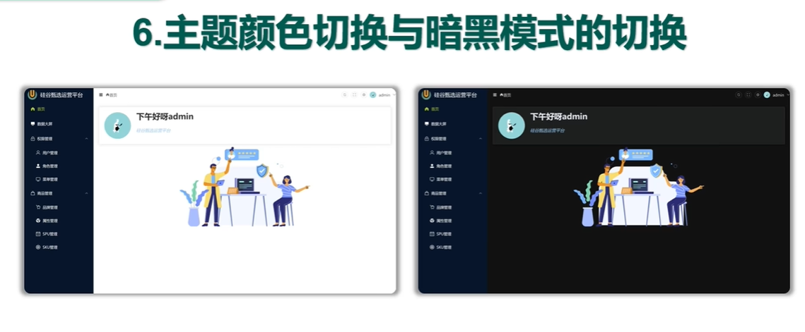

- vue3框架:采用vue框架最新版本,组合式API形式开发项目。
- vite:构建化工具
- TypeScript:TypeScript技术栈
- vue-router:采用vue-router最新版本管理路由
- pinia:采用pinia集中式管理状态
- element-plus:UI组件库采用element-plus
- axios:网络交互
- echarts:数据可视化大屏.....

- 
- 
- 
- 
- 
- 